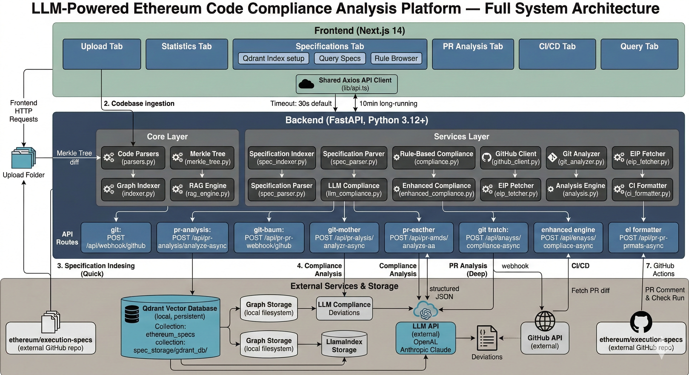

# 🔍 LLM-Powered Ethereum Code Compliance Analysis Platform

<p align="center">
  <strong>Hybrid Property Graph RAG System with Automated PR Analysis</strong>
</p>

<p align="center">
  <a href="#features">Features</a> •
  <a href="#quick-start">Quick Start</a> •
  <a href="#architecture">Architecture</a> •
  <a href="#usage">Usage</a> •
  <a href="#ci-integration">CI Integration</a> •
  <a href="#api-reference">API</a>
</p>

---

## Overview

A comprehensive platform that automates Ethereum protocol compliance verification by combining **Property Graph databases** with **Large Language Models (LLMs)** and **Hybrid RAG** (Retrieval-Augmented Generation). The system analyzes codebases against Ethereum specifications (EIPs, ERCs) to identify compliance gaps, deviations, and potential security vulnerabilities.

### Problem Statement

As the Ethereum protocol evolves through EIPs and specification updates, ensuring that multiple client implementations (Geth, Nethermind, Besu, Reth, etc.) remain compliant becomes increasingly complex. This verification is traditionally manual, time-consuming, and error-prone.

### Solution

This platform provides:

- **Property Graph Construction** from codebases, capturing entities (functions, classes, interfaces) and their relationships
- **Hybrid Specification Search** using keyword + semantic search with Qdrant vector database
- **LLM-Powered Analysis** to identify compliance issues with detailed explanations
- **CI/CD Integration** via GitHub Actions for automated PR-level compliance checking

---

## Features

### Dual-Mode PR Analysis

| Mode | Speed | Description |
|------|-------|-------------|
| **Quick** | ~30 seconds | Diff-based analysis of changed files |
| **Deep** | ~2-5 minutes | Full Property Graph construction with relationship analysis |

### Multi-Language Support

- Go (Ethereum clients like Geth)
- Solidity (Smart contracts)
- Java (Besu client)
- TypeScript / JavaScript
- Python
- Vue / JSX / TSX

### Key Capabilities

- **Specification Management**: Index and manage Ethereum specifications (EIPs, ERCs, Yellow Paper)
- **Graph Visualization**: Interactive visualization of code entity relationships
- **Compliance Reports**: Detailed reports with severity levels (Critical, Warning, Info)
- **CI/CD Native**: GitHub Actions integration with automated PR comments
- **Multiple LLM Providers**: Support for OpenAI-compatible APIs and Anthropic Claude
- **Merkle Tree Incremental Ingestion**: Only re-parses changed files on subsequent ingestion — unchanged files are skipped entirely, saving time and LLM/embedding costs

---

## Quick Start

### Prerequisites

- Python 3.12+
- Node.js 18+
- Git

### 1. Clone the Repository

```bash
git clone https://github.com/your-org/ethereum-compliance-platform.git
cd ethereum-compliance-platform
```

### 2. Backend Setup

```bash
cd backend-worktree/backend

# Create virtual environment
python -m venv .venv
source .venv/bin/activate  # On Windows: .venv\Scripts\activate

# Install dependencies
pip install -r requirements.txt

# Configure environment
cp env.example .env
# Edit .env with your API keys
```

### 3. Frontend Setup

```bash
cd frontend

# Install dependencies
npm install
```

### 4. Configure Environment

Create a `.env` file in the backend directory:

```env
# LLM Configuration (OpenAI-compatible or Anthropic)
OPENAI_API_KEY=your-api-key
OPENAI_API_BASE=https://api.openai.com/v1  # Or your OpenAI-compatible endpoint
LLM_MODEL=gpt-4
EMBED_MODEL=text-embedding-ada-002

# GitHub Token (for PR analysis)
GITHUB_TOKEN=ghp_your_token_here
```

### 5. Start the Application

```bash
# Terminal 1 - Backend
cd backend-worktree/backend
source .venv/bin/activate
python main.py

# Terminal 2 - Frontend
cd frontend
npm run dev
```

Access the application at **http://localhost:3000**

---

## Architecture

<p align="center">
  
</p>

```
┌─────────────────────────────────────────────────────────────────────┐
│                         Frontend (Next.js)                          │
│  ┌──────────┐ ┌──────────┐ ┌──────────┐ ┌──────────┐ ┌──────────┐  │
│  │  Upload  │ │Statistics│ │  Query   │ │Compliance│ │PR Analysis│  │
│  └──────────┘ └──────────┘ └──────────┘ └──────────┘ └──────────┘  │
└─────────────────────────────────────────────────────────────────────┘
                                   │
                                   ▼
┌─────────────────────────────────────────────────────────────────────┐
│                       Backend (FastAPI)                             │
│  ┌─────────────────┐  ┌─────────────────┐  ┌─────────────────┐     │
│  │  Code Parsers   │  │  Graph Indexer  │  │  RAG Engine     │     │
│  │  (Multi-lang)   │  │  (LlamaIndex)   │  │  (Hybrid Search)│     │
│  └─────────────────┘  └─────────────────┘  └─────────────────┘     │
│  ┌─────────────────┐  ┌─────────────────┐  ┌─────────────────┐     │
│  │ Spec Indexer    │  │ LLM Compliance  │  │ GitHub Client   │     │
│  │ (Qdrant)        │  │ (Analysis)      │  │ (PR Integration)│     │
│  └─────────────────┘  └─────────────────┘  └─────────────────┘     │
│  ┌─────────────────┐                                               │
│  │  Merkle Tree    │  ← SHA-256 file hashing for incremental       │
│  │  (Change Detect) │    ingestion (skip unchanged files)           │
│  └─────────────────┘                                               │
└─────────────────────────────────────────────────────────────────────┘
                                   │
                    ┌──────────────┼──────────────┐
                    ▼              ▼              ▼
              ┌──────────┐  ┌──────────┐  ┌──────────┐
              │  Qdrant  │  │  Graph   │  │   LLM    │
              │  Vector  │  │  Storage │  │   API    │
              │  Store   │  │(pkl/json)│  │          │
              └──────────┘  └──────────┘  └──────────┘
```

### Component Overview

| Component | Description |
|-----------|-------------|
| **Code Parsers** | Multi-language AST parsers for Go, Java, Python, TypeScript, etc. |
| **Graph Indexer** | LlamaIndex PropertyGraphIndex for entity-relationship modeling |
| **Merkle Tree** | SHA-256 content-addressable tree for detecting changed files between ingestion runs |
| **RAG Engine** | Hybrid retrieval combining semantic search with keyword matching |
| **Spec Indexer** | Qdrant-based specification storage with chunking |
| **LLM Compliance** | LLM-powered analysis comparing code against specifications |
| **GitHub Client** | PR fetching, diff analysis, and comment posting |

---

## Usage

### 1. Index Specifications

Navigate to the **Specifications** tab to:
- Upload Ethereum specification documents (YAML, Markdown)
- Fetch EIPs directly from ethereum/EIPs repository
- View indexed specification statistics

### 2. Upload Codebase

Use the **Upload** tab to:
- Upload a local folder or ZIP file
- The system parses code and builds a Property Graph
- View statistics about entities and relationships
- **Incremental mode (default)**: Enable the **Merkle Tree** toggle to only re-parse files that changed since the last ingestion — unchanged files are skipped, dramatically reducing indexing time on repeat runs

### 3. Run Compliance Analysis

#### Manual Analysis
Go to **Manual PR Compliance** tab:
- Enter GitHub PR URL (e.g., `https://github.com/ethereum/go-ethereum/pull/27178`)
- Select analysis mode (Quick or Deep)
- View detailed compliance report

#### Query Interface
Use the **Query** tab for natural language questions:
- "How does this codebase handle transaction signing?"
- "Which functions implement EIP-1559 gas calculations?"

### 4. View Results

The **Statistics** tab shows:
- Graph visualization with entities and relationships
- Entity type distribution
- Language breakdown
- Compliance status overview

---

## CI Integration

### GitHub Actions Setup

1. Go to **Automated CI/CD** tab in the application
2. Fill in your repository details:
   - Repository Owner
   - Repository Name
   - Analysis Mode (quick/deep/both)
3. Click **Generate GitHub Actions Workflow**
4. Copy the generated YAML to `.github/workflows/compliance.yml`
5. Add `COMPLIANCE_API_URL` secret in GitHub repository settings

### Example Workflow

```yaml
name: Ethereum Compliance Check

on:
  pull_request:
    branches: [main, master]

jobs:
  compliance:
    runs-on: ubuntu-latest
    steps:
      - uses: actions/checkout@v4
      
      - name: Run Compliance Analysis
        id: compliance
        run: |
          RESPONSE=$(curl -s -X POST "${{ secrets.COMPLIANCE_API_URL }}/api/pr-analysis/ci" \
            -H "Content-Type: application/json" \
            -d '{
              "owner": "${{ github.repository_owner }}",
              "repo": "${{ github.event.repository.name }}",
              "pr_number": ${{ github.event.pull_request.number }},
              "mode": "quick"
            }')
          echo "response=$RESPONSE" >> $GITHUB_OUTPUT
      
      - name: Comment on PR
        if: contains(fromJson(steps.compliance.outputs.response).has_issues, true)
        uses: actions/github-script@v7
        with:
          script: |
            const response = ${{ steps.compliance.outputs.response }};
            github.rest.issues.createComment({
              owner: context.repo.owner,
              repo: context.repo.repo,
              issue_number: context.issue.number,
              body: response.markdown_comment
            });
```

---

## API Reference

### Core Endpoints

| Endpoint | Method | Description |
|----------|--------|-------------|
| `/api/upload-folder` | POST | Upload codebase for full analysis |
| `/api/upload-folder-incremental` | POST | Incremental ingestion (Merkle tree — only changed files) |
| `/api/statistics` | GET | Get graph statistics |
| `/api/graph-data` | GET | Get graph visualization data |
| `/api/query` | POST | Natural language query |

### PR Analysis Endpoints

| Endpoint | Method | Description |
|----------|--------|-------------|
| `/api/pr-analysis/analyze` | POST | Synchronous PR analysis (quick mode) |
| `/api/pr-analysis/analyze-async` | POST | Async PR analysis (deep mode) |
| `/api/pr-analysis/jobs/{job_id}` | GET | Get async job status |
| `/api/pr-analysis/ci` | POST | CI-optimized analysis endpoint |

### Specification Endpoints

| Endpoint | Method | Description |
|----------|--------|-------------|
| `/api/specs/list` | GET | List loaded specifications and rules |
| `/api/specs/upload` | POST | Upload a specification file |
| `/api/specs/eip/{number}` | GET | Fetch and parse a specific EIP |
| `/api/llm-compliance/clone-specs` | POST | Clone ethereum/execution-specs repo |
| `/api/llm-compliance/ingest-specs` | POST | Index specs into Qdrant |
| `/api/llm-compliance/query-specs` | POST | Hybrid search specifications |
| `/api/llm-compliance/spec-stats` | GET | Get specification index statistics |
| `/api/llm-compliance/run-compliance` | POST | Run LLM compliance analysis |

### Configuration

| Endpoint | Method | Description |
|----------|--------|-------------|
| `/api/config` | POST | Configure LLM provider and API keys |
| `/api/config/providers` | GET | List available LLM providers |
| `/health` | GET | Health check |

---

## Project Structure

```
├── backend-worktree/backend/
│   ├── app/
│   │   ├── api/
│   │   │   ├── routes/          # API endpoints
│   │   │   └── app.py           # FastAPI application
│   │   ├── core/
│   │   │   ├── indexer.py       # Graph indexer (full + incremental)
│   │   │   ├── merkle_tree.py   # Merkle tree for change detection
│   │   │   ├── parsers.py       # Multi-language parsers
│   │   │   └── rag_engine.py    # RAG implementation
│   │   ├── services/
│   │   │   ├── enhanced_compliance.py  # PR analysis
│   │   │   ├── llm_compliance.py       # LLM analysis
│   │   │   ├── spec_indexer.py         # Specification indexing
│   │   │   └── github_client.py        # GitHub integration
│   │   └── models/              # Pydantic models
│   ├── tests/                   # Test suite
│   │   └── test_merkle.py       # Merkle tree tests
│   ├── graph_storage/           # Local codebase graphs + Merkle state
│   ├── pr_graph_storage/        # PR analysis graphs
│   └── main.py                  # Entry point
│
├── frontend/
│   ├── app/
│   │   ├── layout.tsx
│   │   └── page.tsx             # Main application
│   ├── components/
│   │   ├── PRAnalysisView.tsx   # PR analysis UI
│   │   ├── StatsView.tsx        # Statistics & visualization
│   │   ├── UploadStep.tsx       # Upload with incremental toggle
│   │   ├── GitAnalysisView.tsx  # CI/CD setup
│   │   └── ...
│   └── lib/
│       └── api.ts               # API client
│
├── CI_INTEGRATION_GUIDE.md
├── ARCHITECTURE_DIAGRAM.puml
└── README.md
```

---

## Configuration Options

### LLM Providers

#### OpenAI / OpenAI-Compatible

```env
LLM_PROVIDER=openai
OPENAI_API_KEY=sk-...
OPENAI_API_BASE=https://api.openai.com/v1
LLM_MODEL=gpt-4
```

#### Anthropic Claude

```env
LLM_PROVIDER=anthropic
OPENAI_API_KEY=sk-ant-...
LLM_MODEL=claude-sonnet-4-20250514
# Embeddings still need an OpenAI-compatible endpoint:
EMBED_MODEL=text-embedding-ada-002
```

### Analysis Modes

| Mode | Use Case | Performance |
|------|----------|-------------|
| `quick` | CI pipelines, rapid feedback | ~30s, diff-only |
| `deep` | Comprehensive review | ~2-5min, full graph |
| `both` | Complete analysis | Quick first, then deep |

### Incremental Ingestion (Merkle Tree)

The platform uses a **Merkle tree** to avoid re-processing unchanged code on repeated ingestion:

1. **First run** — full parse of the entire codebase; a SHA-256 hash is stored for every source file in `graph_storage/merkle_state.json`.
2. **Subsequent runs** — the Merkle tree diffs file hashes to identify **added**, **modified**, and **deleted** files. Only those files are re-parsed. Entities and relationships belonging to changed/deleted files are purged from the graph before the new ones are merged in.
3. **No changes detected** — returns immediately with zero LLM or embedding calls.

This is enabled by default in the frontend (the "Incremental Ingestion" toggle in the Upload tab) and is accessible via the `POST /api/upload-folder-incremental` API endpoint.

---

## Contributing

1. Fork the repository
2. Create a feature branch (`git checkout -b feature/amazing-feature`)
3. Commit your changes (`git commit -m 'Add amazing feature'`)
4. Push to the branch (`git push origin feature/amazing-feature`)
5. Open a Pull Request

---

## License

This project is licensed under the MIT License - see the [LICENSE](LICENSE) file for details.

---

## Acknowledgments

- **Ethereum Foundation** - For the ESP program and specification standards
- **LlamaIndex** - For the excellent RAG framework
- **Qdrant** - For the vector database

---

<p align="center">
  Built with ❤️ for the Ethereum ecosystem
</p>
